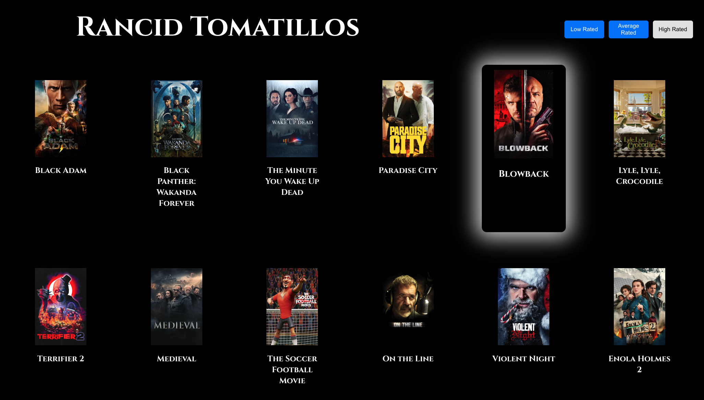
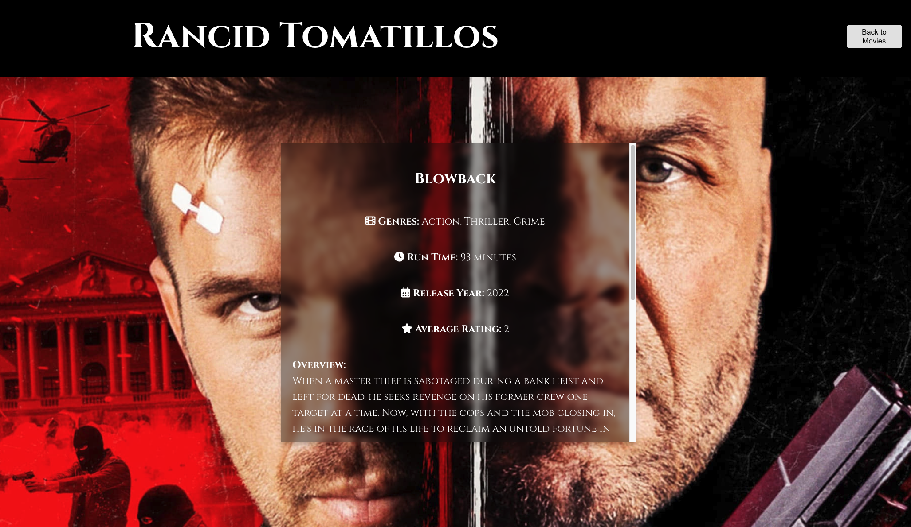

<h1 align="center"> Rancid Tomatillos </h1>

### Abstract:

Rotten Tomatillos is a website to browse and view information on movies! The user is able to scroll through a list of movies, filter by rating, and click into a specific movie to view more details on it.

### Technologies Used

In order to get this site working, we used React, React Router, accessed data with Fetch API, and tested with Cypress.

### Preview of App:
[Preview Here:](https://rushyyz.live/rancid-tomatillos)

### Contributors:

- Florenzo Bauer: https://github.com/florenzobauer
- Jamie Francisco: https://github.com/jamiefrancisco

### Wins + Challenges:

* Win: Filtering by movie rating was a great challenge, but ultimately a win! There was complicated logic to be able to get the filtering functionality how we wanted - where the user would be able to filter by multiple rating tags at the same time and have the buttons reflect their state visually.
* Challenge: Because this was our first time using React Router, it was a challenge to fit all the components together by routing instead of hiding/showing elements.
